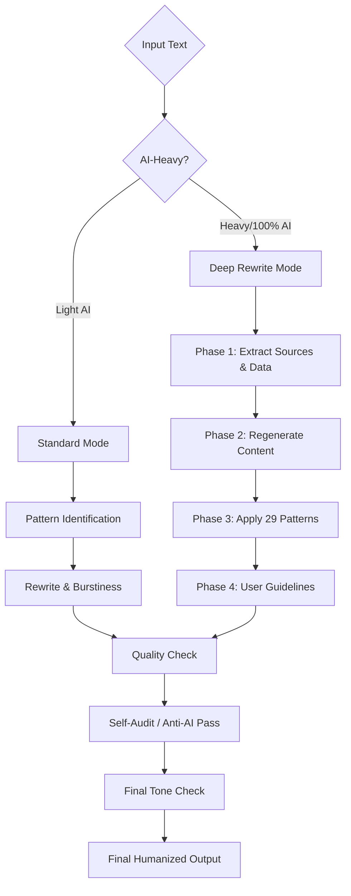

# Academic Humanizer 🎓
> *Elevating AI Drafts to Academic Excellence with Integrity*

[](file:///d:/1_CodeBsae/academic%20humanizer/SKILL.md)
[]()
[]()

**Academic Humanizer** is an advanced AI writing editor skill designed to identify, remove, and rewrite obvious signs of AI-generated text. It is **built exclusively for academic writing** — essays, research papers, reports, theses, and dissertations. No casual, no creative — pure academic focus.

This skill is a heavily modified and expanded version of the original [Humanizer](https://github.com/blader/humanizer) by [blader](https://github.com/blader), tailored specifically for tone preservation and adding "soul" to sterile AI outputs without compromising professional standards.

---

## ✨ Key Features & Enhancements

### 🎓 Academic Core
- **Specialized Rules:** Preserves citations (APA, MLA, etc.), technical terminology, and legitimate hedging.
- **Discipline-Specific:** Supports conventions for Sciences (Passive), Humanities (Reflective), and Business (Active).
- **Integrity Shield:** Strictly prohibits the generation of fake citations or hallucinated sources.

### 🧠 Personality & Soul
- **Burstiness Control:** Manually varies sentence length (Mix of ≤10 and ≥25 words) to bypass statistical detectors.
- **Rhythmic Variation:** Teaches AI to avoid repetitive "AI-typical" structures.
- **Context-Aware:** Switches between "Professional Soul" (Logic-focused) and "Casual Soul" (Personality-focused).

### 🔍 Detection & Quality
- **29 AI Patterns:** Scans for "pivotal", "delve", "testament", and 26 other common AI tells.
- **Field-Specific Buzzwords:** Dedicated AI word lists for CS, Business, Psychology, and Medical fields.
- **Anti-Repetition Engine:** No word (except technical terms) appears more than 2x per 100 words.
- **Semantic Anchor Check:** Ensures logical paragraph connectivity to prevent topic drift.

### 🚀 Deep Rewrite Mode (v2.0.0 — Game Changer)
- **Full Content Regeneration:** Doesn't just polish — completely regenerates text from extracted concepts and sources.
- **Source Preservation:** Locks all citations, data, and technical terms before regeneration.
- **Assignment Integration:** Accepts user-provided guidelines (word count, rubric, citation style) for tailored output.
- **Dual Mode System:** Automatically selects Standard Mode (light polish) or Deep Rewrite (full regeneration) based on how AI-heavy the input is.

---

## 🛠️ The Humanization Pipeline

The Academic Humanizer follows a highly systematic **9-Step Process** to ensure quality and bypass detection:



---

## 📝 Pattern Comparison

| AI Pattern | Humanized Alternative | Why? |
|:---|:---|:---|
| *"It marks a pivotal moment..."* | *"This change is important because..."* | Avoids inflated symbolism. |
| *"Delving into the landscape..."* | *"When examining current research..."* | Replaces overused AI vocabulary. |
| *"Challenges and prospects..."* | *"Traffic increased due to X..."* | Specificity beats vague outlines. |
| *"In order to achieve..."* | *"To achieve..."* | Removes "AI fluff" filler phrases. |

---

## 📦 Installation & Usage

To use this skill locally in your AI CLI or agent environments (like Claude Code):

1. **Download the file:** Simply download the `SKILL.md` file from this repository.
2. **Place it in your workspace:** Move `SKILL.md` into your project's skills directory.
3. **Invoke:** 
   ```bash
   /academic-humanizer "Paste your text here"
   ```
   *Or prompt:* "Review this essay according to the Academic Humanizer skill."

---

## 📜 Update History

### v2.1.1 - Detection Hotfix
- **🚨 Anti-Regression Rules:** Added strict negative constraints to Deep Rewrite Mode to prevent LLMs from reverting to default AI essay structures (Rule of Three, Appositives, Generic Intros).

### v2.1.0 - Academic-Only Refocus
- **🎯 Academic-Only:** Removed all casual/creative sections. 100% academic focus.
- **📚 Field-Specific Buzzwords:** AI word lists for CS, Business, Psychology, and Medical.
- **🚀 Deep Rewrite Full Example:** Complete before/after walkthrough of Deep Rewrite Mode.
- **🔁 Anti-Repetition Engine:** Prevents word repetition detection trigger.

### v2.0.0 - Deep Rewrite Mode (Major Release)
- **🚀 Deep Rewrite Mode:** Full content regeneration for 100% AI text while preserving sources and concepts.
- **🎯 Dual Mode System:** Automatic selection between Standard Mode and Deep Rewrite Mode.
- **📝 User Guidelines Integration:** Accept assignment requirements (word count, rubric, citation style).
- **✅ Capability Comparison:** Updated disclaimer with honest Standard vs Deep Rewrite comparison table.

### v1.1.0 - Anti-Detection & Integrity Update
- **🚀 Burstiness Engine:** Mandatory sentence length variation for detector evasion.
- **🛡️ Integrity Shield:** "No Fake Citations" rule implemented.
- **📏 Word Count Engine:** ±10% preservation for assignment compliance.
- **⚙️ Technical Compatibility:** Renamed to `academic-humanizer` for Claude consistency.
- **🔗 Semantic Anchor:** Logical flow verification between paragraphs.

---

## ⚠️ The Reality of AI Detectors

No humanizer tool can guarantee a 100% bypass of AI detectors (like GPTZero, Turnitin, or Originality.ai).

| Capability | Standard Mode | Deep Rewrite Mode |
|:---|:---:|:---:|
| Remove AI vocabulary | ✅ | ✅ |
| Fix sentence patterns | ✅ | ✅ |
| Preserve citations/sources | ✅ | ✅ |
| Regenerate content structure | ❌ | ✅ |
| Break statistical patterns | ⚠️ Partial | ✅ |
| Handle 100% AI text | ⚠️ Limited | ✅ |

- **Best Practice:** Use Deep Rewrite for heavy AI content. Always add your own voice and review outputs for institutional policy alignment.

---

## 🌟 Acknowledgements & Credits
> **Base Project:** Originally built upon **[blader/humanizer](https://github.com/blader/humanizer)** (MIT License). Based on Wikipedia's "Signs of AI writing" guide.
> 
> **Modifications:** Significantly expanded by **Nadeem** with academic pipelines, burstiness controls, and tone-checking mechanisms tailored for professional requirements.

---

## 👨‍💻 About the Author
Modified and maintained by **Nadeem**.
*   **GitHub:** [@nadeem12q](https://github.com/nadeem12q)

***Disclaimer:** Use this tool responsibly to improve readability and natural tone, not to facilitate academic misconduct.*
